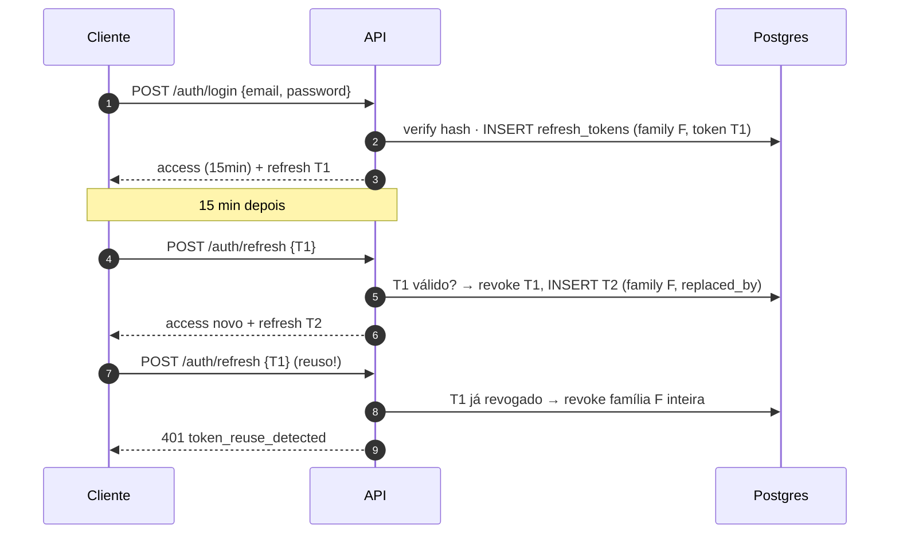
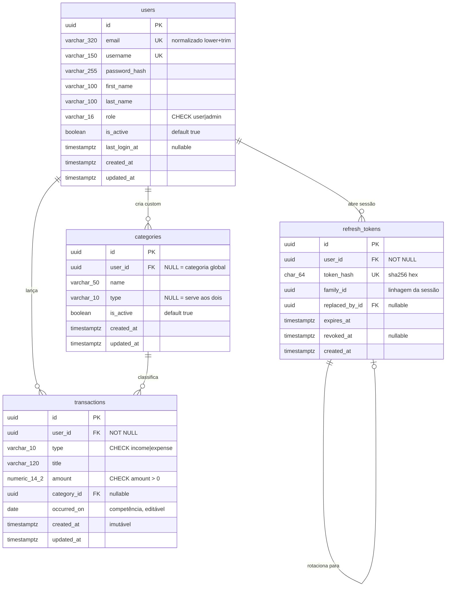

# Finance API v2 — Documento de Arquitetura

**Status:** proposta para aprovação · **Escopo:** redesenho do domínio em FastAPI · **Código não implementado nesta rodada.**

Este documento redesenha a API de finanças pessoais que hoje existe em Django 5.1 + DRF. Não é uma tradução: onde o desenho antigo estava errado, ele muda, e a mudança é justificada. Os 16 problemas listados no briefing são tratados como requisitos de correção e rastreados um a um na seção 8.

---

## 0. Princípios de desenho

Cinco decisões atravessam o documento inteiro. Vale enunciá-las antes porque quase toda escolha específica cai delas:

1. **Bug estrutural se elimina, não se conserta.** Sempre que possível, o redesenho torna a classe do bug *impossível de representar* em vez de corrigir a ocorrência. O saldo com janelas diferentes (problema 2) some porque passa a existir uma única janela por construção, não porque alguém alinhou duas queries.
2. **Uma responsabilidade, uma camada.** Escopo por usuário é imposto em um lugar só (o repositório). Data "hoje" vem de um lugar só (o `Clock`). Autorização vem de um lugar só (dependência de router).
3. **Leitura não escreve.** Nenhum `GET` altera estado. Isso mata a tabela `Balance` como cache gravado em leitura.
4. **Organização por camada, um arquivo por recurso.** `api/routes/`, `services/`, `repositories/`, `models/`, `schemas/`, `core/` e `dependencies/`. Dentro de cada camada, cada recurso tem o seu arquivo: nenhum arquivo concentra rotas de recursos diferentes, e endpoint agregado (saldo, relatório) tem o seu próprio arquivo de rotas — que é o que faltava no `urls.py` único do sistema antigo.
5. **Configuração é ambiente.** Nada de `DEBUG=True` ou CORS aberto no código. Tudo entra por `pydantic-settings`, e a aplicação recusa subir sem as variáveis obrigatórias.

**Convenções adotadas nas suas respostas de escopo:** categorias são tabela global + custom por usuário; fuso é único, configurável por `APP_TIMEZONE`; o `/admin/` do Django é substituído por rotas `/api/v1/admin/*` protegidas por role.

---

## 1. Decisões estruturais

### 1.1 `Income` + `Expense` → uma entidade `Transaction` — **recomendado**

Esta é a decisão que mais muda o resto do desenho, então vale desenvolver.

**O que de fato difere entre as duas tabelas hoje:** nada. Mesmos campos, mesmos tipos, mesma FK, mesma semântica de leitura, mesmos endpoints espelhados. A única diferença real é o **sinal com que cada uma entra no saldo** — e sinal é um atributo do lançamento, não uma justificativa para uma tabela.

**Por que unificar:**

- **O saldo vira uma query só, com uma janela só.** Hoje receita e despesa são somadas em duas consultas independentes, e foi exatamente isso que permitiu o problema 2 (despesas somadas no intervalo arredondado para meses inteiros, receitas no intervalo exato). Com uma tabela, o saldo é `SUM(...) FILTER (WHERE type = 'income')` e `SUM(...) FILTER (WHERE type = 'expense')` sob o **mesmo `WHERE`**. As duas pontas da subtração passam a compartilhar a janela por construção — não por disciplina.
- **Uma regra em vez de duas cópias.** Um repositório, um serviço, um conjunto de validações, uma política de escopo, um conjunto de índices. O problema 8 é literalmente "temos dois de tudo"; toda correção hoje precisa ser aplicada duas vezes, e a segunda é a que é esquecida.
- **Extrato cronológico misto fica trivial.** O PDF do período precisa listar receitas e despesas intercaladas por data. Com duas tabelas isso é `UNION ALL` em SQL ou *merge* em Python — com uma, é o `ORDER BY` natural da listagem.
- **Campos novos entram uma vez.** A data de competência (problema 3) precisa existir nos dois lados; com uma tabela, é uma coluna e uma migration.
- **Categoria compartilhada.** Uma FK, um catálogo, agregação por categoria atravessando receita e despesa sem esforço.

**Por que alguém manteria separadas — e por que não convence aqui:**

- *"Elas vão divergir no futuro."* Podem. Mas hoje não divergem, e o custo de antecipar a divergência é pagar duplicação garantida por um benefício hipotético. Se um dos tipos ganhar campos exclusivos, o caminho correto é uma tabela satélite (`expense_details`), não duas tabelas gêmeas.
- *"Consultar só despesas fica mais caro."* Passa a exigir o predicado `type`, coberto pelo índice `(user_id, type, occurred_on DESC)`. Custo desprezível nesta ordem de grandeza.
- *"Os clientes existentes falam `/incomes` e `/expenses`."* Continuam falando — ver abaixo.

**Recomendação:** tabela única `transactions` com `type ∈ {income, expense}`.

**Sinal do valor:** `amount NUMERIC(14,2)` **sempre positivo**, com `CHECK (amount > 0)`; o sinal é derivado do `type`. A alternativa (valor com sinal e sem coluna de tipo) foi rejeitada porque admite dois estados sem sentido — receita negativa e despesa positiva — cria duas representações para o mesmo fato e obriga `ABS()` em todo relatório.

**Compatibilidade de rotas sem duplicar código:** `/incomes` e `/expenses` continuam existindo como **projeções tipadas** da mesma tabela, geradas por uma fábrica de router:

```python
# api/routes/transactions.py
def build_typed_router(tx_type: TransactionType, prefix: str) -> APIRouter: ...

income_router  = build_typed_router(TransactionType.INCOME,  "/incomes")
expense_router = build_typed_router(TransactionType.EXPENSE, "/expenses")
transaction_router = ...  # /transactions, com `type` obrigatório no corpo e filtrável
```

Nessas rotas o `type` vem do path e **nunca** do corpo — enviar `type` em `POST /incomes` é `422`. Assim o contrato antigo é preservado, existe um endpoint unificado novo (`/transactions`) para o extrato misto, e a lógica existe uma vez só.

### 1.2 `Balance`: tabela materializada → **cálculo puro** — recomendado

**Diagnóstico do desenho antigo:** `Balance` é cache derivado sem dono do momento de atualização. Quando ninguém é responsável por atualizar, o cache acaba atualizado no único lugar que o lê — daí o `GET` que escreve no banco, e a linha criada sem `user` gerando órfãos (problema 9).

**Volume real:** um usuário intenso lança ~200 transações/mês, ~2.400/ano. Mesmo com dezenas de milhares de usuários, um `GROUP BY` por usuário sobre o índice `(user_id, occurred_on)` toca poucas centenas de linhas e responde em sub-milissegundo. O cache não se paga: ele custa mais em corretude (defasagem, órfãos, escrita em leitura) do que economiza em tempo.

**Recomendação:** `Balance` **deixa de ser tabela**. Vira agregação no `BalanceRepository` (SQL) mais o `BalanceService` (montagem da série, preenchimento de meses sem lançamento).

```sql
-- Uma janela, os dois lados. O problema 2 deixa de ser representável.
SELECT
    COALESCE(SUM(amount) FILTER (WHERE type = 'income'),  0) AS total_income,
    COALESCE(SUM(amount) FILTER (WHERE type = 'expense'), 0) AS total_expense
FROM transactions
WHERE user_id = :user_id
  AND occurred_on >= :start_date
  AND occurred_on <= :end_date;
```

**Escape hatch documentado (não implementar agora).** Se algum dia o volume justificar, a ordem de escalada é: (1) índice coberto; (2) `MATERIALIZED VIEW monthly_balance` com `REFRESH` agendado; (3) tabela mantida por evento de domínio disparado **after-commit** na escrita da transação. Em nenhuma hipótese durante um `GET`. Gatilho objetivo para reavaliar: p95 de `/balance/monthly` acima de 150 ms.

### 1.3 `role` como coluna em `users`, e autorização de verdade — recomendado

**Problema do `Profile` por signal:** o dado nasce fora do fluxo que cria o usuário. Isso significa que ele *pode não existir* (usuário criado por `bulk_create`, por fixture, por migration), obriga um JOIN em toda checagem de permissão, e esconde a regra num handler que ninguém lê ao ler o model.

**Recomendação:** eliminar `Profile`. `users.role VARCHAR(16) NOT NULL DEFAULT 'user' CHECK (role IN ('user','admin'))`, mapeado para `class Role(StrEnum)` em Python.

- **Por que `VARCHAR` + `CHECK` e não `ENUM` nativo do Postgres:** alterar um `CHECK` é um `ALTER TABLE` simples e reversível no Alembic; `ALTER TYPE ... ADD VALUE` tem restrições transacionais e remover valor exige recriar o tipo e reescrever colunas. O ganho de armazenamento do enum nativo é irrelevante nesta escala. Mesmo critério vale para `transactions.type`.
- **Um eixo só.** `is_superuser` e `is_staff` desaparecem — dois booleanos e um inteiro descrevendo a mesma coisa é como se perde o controle de quem pode o quê. Fica `role`, mais `is_active` (que é estado da conta, não permissão).
- **Como isso vira autorização:** uma dependência `require_role(Role.ADMIN)` aplicada no `APIRouter` inteiro do admin, **nunca rota a rota** (repetir é como se esquece — origem dos problemas 4 e 5).
- **Bootstrap:** o primeiro admin nasce por comando de CLI (`python -m cli create-admin`), nunca por registro público. Promoção posterior só por outro admin via `PATCH /api/v1/admin/users/{id}`.
- **Trava anti-lockout:** um admin não pode remover o próprio `role`, se desativar nem se deletar (`409`).

### 1.4 Revogação de refresh token sem SimpleJWT — recomendado

**Access token:** JWT stateless, TTL curto (15 min), claims mínimas — `sub`, `role`, `jti`, `iat`, `exp`, `typ="access"`. **Sem lista de revogação:** consultar estado a cada requisição anula a razão de existir do JWT; a janela de exposição é o próprio TTL, e é por isso que ele é curto.

**Refresh token:** **opaco**, não JWT. 32 bytes de `secrets.token_urlsafe`, guardado no banco como **SHA-256 do valor** (é credencial de longa duração — se o dump vazar, o hash não é utilizável). TTL 30 dias.

> Por que opaco e não JWT: a revogação precisa ser autoritativa, o que significa consultar o banco de qualquer forma para checar o `jti`. Sendo assim, o JWT não adiciona nada além de superfície de erro (algoritmo, chave, validação de claims).

**Rotação com detecção de reuso:**

- Todo `POST /auth/refresh` **invalida o token usado** e emite um par novo; `replaced_by_id` encadeia a sequência e `family_id` agrupa a linhagem de uma sessão.
- Se chegar um refresh **já rotacionado** (`revoked_at IS NOT NULL`), o sinal é clássico de token roubado: revoga-se a **família inteira** e retorna `401`. O atacante e o usuário legítimo são ambos deslogados — que é o comportamento correto.
- `POST /auth/logout` revoga o token enviado; idempotente, sempre `204`.
- Trocar senha ou desativar a conta revoga **todas** as famílias do usuário.

**Por que Postgres e não Redis:** o compose alvo é app + banco. Refresh acontece uma vez a cada 15 min por sessão ativa — carga desprezível para o Postgres, e uma dependência a menos para operar. A interface `RefreshTokenRepository` isola a decisão: trocar por Redis depois é escrever uma implementação nova, não refatorar.

**Higiene:** `DELETE FROM refresh_tokens WHERE expires_at < now() - interval '7 days'` num comando de manutenção (fase 6), nunca dentro de um request.



### 1.5 Modelagem de `category`: tabela global + custom por usuário — sua escolha, confirmada

`category` como string livre é o que faz "Mercado", "mercado" e "Merc." virarem três categorias — e todo agrupamento passa a mentir. Enum resolveria a integridade, mas mudar a lista viraria migration e o usuário nunca criaria a dele.

**Modelo adotado:** tabela `categories` onde `user_id IS NULL` significa **categoria global** (semeada por migration de dados, administrável por admin) e `user_id = X` significa **categoria própria de X**.

- **Visibilidade:** `WHERE user_id IS NULL OR user_id = :owner`, imposta no repositório.
- **Unicidade:** dois índices parciais sobre `lower(name)` — um para globais, um por usuário — porque `UNIQUE` comum trata `NULL` como distinto e deixaria duplicar globais.
- **Tipagem opcional:** `categories.type` é anulável; `NULL` = serve a receitas e despesas. "Salário" pode ser marcada como `income` e o serviço rejeita usá-la numa despesa (`422`).
- **`category_id` é opcional na transação** — o modelo antigo permitia texto vazio, e tornar obrigatório seria inventar requisito.
- **Exclusão:** FK `ON DELETE RESTRICT`. Categoria em uso retorna `409` sugerindo desativar; `is_active = false` some da lista de escolha mas mantém o histórico legível.

### 1.6 Fluxo de login único — recomendado

Um endpoint, um contrato:

```
POST /api/v1/auth/login   {"email": "...", "password": "..."}
→ 200 {"access_token": "...", "refresh_token": "...", "token_type": "bearer", "expires_in": 900}
```

- `/api/token/` **deixa de existir**. Dois fluxos paralelos com payloads diferentes (problema 6) significam duas superfícies para auditar, e a que ninguém usa é a que fica insegura. O backend de token por sessão instalado-e-nunca-usado sai junto.
- **Claims extras saem do token.** `username`, `email` e `first_name` dentro do JWT ficam velhos no instante em que o usuário edita o perfil, e inflam o header de toda requisição. Fica apenas `role`, que é o que a autorização precisa ler sem ir ao banco. Perfil vem de `GET /users/me`.
- **`email` vira `UNIQUE` e normalizado** (trim + lowercase na entrada). O problema 7 é resolvido na raiz: a ambiguidade de dois usuários com o mesmo email deixa de existir, então não há `get_user()` frágil para implementar.
- **Erro único** para email inexistente e senha errada (`401 invalid_credentials`), e verificação de hash *dummy* quando o usuário não existe, para que o tempo de resposta não vaze a existência da conta.

### 1.7 Datas e fuso — sua escolha (fuso único via `APP_TIMEZONE`), detalhada

| Conceito | Coluna | Tipo | Regra |
|---|---|---|---|
| Competência (data do fato) | `occurred_on` | `DATE` | Obrigatória, **editável**. Default = hoje no `APP_TIMEZONE` se omitida. |
| Criação do registro | `created_at` | `TIMESTAMPTZ` | Imutável, UTC, gerada pelo banco. |
| Última alteração | `updated_at` | `TIMESTAMPTZ` | UTC, atualizada em toda escrita. |

- **Toda a agregação filtra por `occurred_on`, nunca por `created_at`.** É isso que torna possível o lançamento retroativo (problema 3) — hoje impossível porque `auto_now_add` é a única data existente.
- **Competência é `DATE`, sem hora.** Isso elimina por construção a classe de bug do `23:59:59.999` e a ambiguidade de fuso em intervalos: `occurred_on >= :start AND occurred_on <= :end` é inclusivo nas duas pontas, ponto final.
- **`TIMESTAMPTZ` é sempre UTC** na aplicação (`datetime.now(UTC)`) e no banco. Fuso só aparece na fronteira.
- **"Hoje" e "mês corrente" vêm de um `Clock` único** (`core/clock.py`) que lê `APP_TIMEZONE` das settings. `date.today()` espalhado pelo código é o que torna esse comportamento intestável — com o `Clock` injetado, congelar o tempo no teste é trivial.
- **Mês é `YYYY-MM` na API**, string, não data. O "primeiro dia do mês" do modelo antigo era um `DATE` fingindo ser um mês, e convidava a comparações erradas.

### 1.8 Substituto do `/admin/` — sua escolha (rotas por role), detalhada

Router dedicado, montado em `/api/v1/admin`, com `dependencies=[Depends(require_role(Role.ADMIN))]` no router inteiro.

**Escopo deliberadamente estreito:** gestão de **contas** (listar, ver, criar, editar, ativar/desativar, excluir) e de **categorias globais**. 

**Admin não acessa lançamento de ninguém.** Privacidade por usuário é requisito do domínio ("ninguém enxerga lançamento de ninguém"), e um endpoint administrativo que lê transações de terceiros seria a maior regressão possível em relação ao objetivo da reescrita. Se algum dia houver necessidade de suporte, o caminho é agregado anonimizado, não leitura de linha.

Sem HTML, sem Jinja, sem framework de admin: as rotas são documentadas no OpenAPI com a tag `admin` e testadas como qualquer outra.

---

## 2. Árvore de diretórios

Organização **por camada**, com um arquivo por recurso dentro de cada uma. Quando um arquivo crescer demais, vira pacote com o mesmo nome — a forma não muda.

```
finance-api-v2/
├── pyproject.toml                   # deps, ruff, mypy, pytest — fonte única de config de tooling
├── docker-compose.yml               # api + db + db-test (banco de teste é serviço, não SQLite)
├── Dockerfile
├── alembic.ini
├── .env.example                     # todas as variáveis, sem um único segredo real
├── alembic/
│   └── versions/                    # migrations = fonte da verdade do schema (nunca create_all)
├── src/                             # raiz de import: `from core.config import ...`
│   ├── main.py                      # fábrica create_app(); registra handlers de erro e os routers
│   ├── version.py                   # __version__, exposto em /health e no OpenAPI
│   ├── cli.py                       # comandos operacionais (create-admin, purge-tokens)
│   │
│   ├── api/
│   │   ├── router.py                # único ponto que faz include_router; nada de lógica aqui
│   │   └── routes/                  # um arquivo por recurso; sem SQL e sem regra de negócio
│   │       ├── auth.py              # register, login, refresh, logout — o único sem autenticação
│   │       ├── users.py             # /users/me
│   │       ├── admin_users.py       # /admin/users, sob require_role(ADMIN)
│   │       ├── categories.py
│   │       ├── transactions.py      # /transactions + os routers tipados /incomes e /expenses
│   │       ├── balance.py           # /balance/month, /balance/monthly, /balance/range
│   │       ├── reports.py           # PDF do período
│   │       └── health.py            # /health e /health/ready — fora de /api/v1, sem versão
│   │
│   ├── schemas/                     # Pydantic v2 de entrada/saída — nunca expõem model
│   │   ├── user.py                  # UserOut, UserUpdateIn, e os tipos Email/Username/Password
│   │   ├── auth.py                  # RegisterIn, LoginIn, TokenPairOut
│   │   ├── category.py
│   │   ├── transaction.py
│   │   └── balance.py
│   │
│   ├── models/                      # mapeamento ORM e constraints; um arquivo por tabela
│   │   ├── user.py                  # User (com role — sem Profile) e o enum Role
│   │   ├── refresh_token.py
│   │   ├── category.py
│   │   └── transaction.py           # Transaction e o enum TransactionType
│   │
│   ├── repositories/                # toda a construção de query
│   │   ├── base.py                  # OwnedRepository — onde o escopo por usuário é imposto
│   │   ├── user_repository.py
│   │   ├── refresh_token_repository.py
│   │   ├── category_repository.py
│   │   ├── transaction_repository.py
│   │   └── balance_repository.py    # SQL de agregação; sem tabela própria
│   │
│   ├── services/                    # regra de negócio, em Python puro (zero FastAPI)
│   │   ├── auth_service.py          # rotação, detecção de reuso, revogação de família
│   │   ├── user_service.py
│   │   ├── category_service.py
│   │   ├── transaction_service.py
│   │   ├── balance_service.py       # série mensal, meses vazios, validação de período
│   │   └── pdf_builder.py           # Platypus puro, sem HTTP e sem ORM — testável unitariamente
│   │
│   ├── core/                        # infraestrutura transversal, sem regra de negócio
│   │   ├── config.py                # Settings (pydantic-settings); app não sobe sem o obrigatório
│   │   ├── database.py              # Base declarativa, TimestampMixin, engine e sessionmaker
│   │   ├── security.py              # argon2 hash/verify, JWT, geração de tokens opacos
│   │   ├── clock.py                 # Clock de instante injetável: now_utc, today, current_month
│   │   ├── errors.py                # catálogo de erros + handlers → envelope único
│   │   └── pagination.py            # PageParams e Page[T] genérico
│   │
│   └── dependencies/                # toda a fiação de Depends fica aqui, e só aqui
│       ├── database.py              # get_session
│       ├── state.py                 # settings, clock, hasher e codec vindos de app.state
│       ├── auth.py                  # get_current_user, require_role
│       ├── repositories.py          # fábricas dos repositórios (é onde o dono é preenchido)
│       └── services.py              # fábricas dos serviços
│
├── assets/logo.png                  # usado pelo PDF; resolvido em runtime, nunca no import
└── tests/
    ├── conftest.py                  # engine de teste, migrations, sessão isolada, client
    ├── factories.py                 # builders explícitos de dados
    ├── unit/                        # sem I/O: clock, security, período, pdf_builder, services
    └── integration/                 # endpoints via httpx.AsyncClient contra Postgres real
        └── test_authorization_matrix.py
```

**Responsabilidade de cada camada, em uma linha:**

| Camada | Responsabilidade | Nunca faz |
|---|---|---|
| `api/routes` | Traduz HTTP ↔ domínio: valida entrada via schema, chama serviço, devolve schema e status. | SQL, regra de negócio, `if role ==` |
| `schemas` | Contrato público de entrada e saída, separado do ORM. | Tocar banco, carregar model |
| `models` | Mapeamento ORM e constraints do banco. | Regra de negócio, validação de entrada |
| `repositories` | Toda a construção de query; **impõe o escopo por usuário**. | Decidir regra, conhecer HTTP |
| `services` | Regra de negócio, orquestração e transação; levanta exceção de domínio. | Conhecer `Request`/`Response` |
| `core` | Infra transversal: config, banco, segurança, relógio, erros, paginação. | Conhecer um recurso específico |
| `dependencies` | Toda a fiação de `Depends`: sessão, usuário atual, papel, repositórios, serviços. | Conter regra de negócio |

O ponto do problema 16 fica explícito: `/balance/monthly` mora em `api/routes/balance.py`, e `api/router.py` só faz `include_router`. O que existia no Django era um `urls.py` único concentrando os endpoints agregados de todos os módulos; aqui cada recurso tem o seu arquivo.

**`services/` e `repositories/` não importam FastAPI.** É o que a separação de `dependencies/` compra: regra de negócio e SQL são Python puro, testáveis sem framework web. Nenhum `Depends` aparece fora de `dependencies/` e `api/routes/`.

**O custo desta organização, dito de frente:** mexer numa feature toca cinco pastas em vez de uma, e a coesão é por camada, não por assunto. Em troca, cada camada tem uma fronteira única e verificável — e é o que torna possível a regra acima ("nenhum import de FastAPI abaixo de `dependencies/`"), que numa organização por domínio precisaria ser conferida pasta a pasta.

**Não existe pacote `shared/`.** Uma pasta com esse nome atrai tudo o que ninguém sabe onde colocar, e em seis meses é a maior do projeto. Cada peça tem um dono óbvio: infraestrutura vai para `core/`, tipo de domínio vai para o `models/` do recurso que o define (`Role` em `models/user.py`, `TransactionType` em `models/transaction.py`).

---

## 3. Modelo de dados

### 3.1 Diagrama



### 3.2 Tabelas em detalhe

#### `users`

| Coluna | Tipo | Constraints |
|---|---|---|
| `id` | `UUID` | PK, default `gen_random_uuid()` |
| `email` | `VARCHAR(320)` | `NOT NULL`, `UNIQUE`, normalizado (trim + lower) na aplicação |
| `username` | `VARCHAR(150)` | `NOT NULL`, `UNIQUE` — identificador de exibição; **não é mais credencial de login** |
| `password_hash` | `VARCHAR(255)` | `NOT NULL` (argon2id) |
| `first_name` / `last_name` | `VARCHAR(100)` | `NOT NULL DEFAULT ''` |
| `role` | `VARCHAR(16)` | `NOT NULL DEFAULT 'user'`, `CHECK (role IN ('user','admin'))` |
| `is_active` | `BOOLEAN` | `NOT NULL DEFAULT true` |
| `last_login_at` | `TIMESTAMPTZ` | nullable |
| `created_at` / `updated_at` | `TIMESTAMPTZ` | `NOT NULL DEFAULT now()` |

- **Índices:** `UNIQUE(email)`, `UNIQUE(username)`.
- **Removidos:** `is_superuser`, `is_staff`, `date_joined` (→ `created_at`), `last_login` (→ `last_login_at`), e a tabela `Profile` inteira.
- **Chave UUID** em vez de sequencial: IDs aparecem em URL administrativa e em payload; UUID evita enumeração trivial de contas. O escopo por usuário já protege, mas não custa nada aqui.

#### `categories`

| Coluna | Tipo | Constraints |
|---|---|---|
| `id` | `UUID` | PK |
| `user_id` | `UUID` | FK → `users(id) ON DELETE CASCADE`, **nullable** (`NULL` = global) |
| `name` | `VARCHAR(50)` | `NOT NULL`, não vazio |
| `type` | `VARCHAR(10)` | nullable, `CHECK (type IN ('income','expense'))` |
| `is_active` | `BOOLEAN` | `NOT NULL DEFAULT true` |
| `created_at` / `updated_at` | `TIMESTAMPTZ` | `NOT NULL DEFAULT now()` |

```sql
CREATE UNIQUE INDEX ux_categories_global_name
    ON categories (lower(name)) WHERE user_id IS NULL;
CREATE UNIQUE INDEX ux_categories_user_name
    ON categories (user_id, lower(name)) WHERE user_id IS NOT NULL;
CREATE INDEX ix_categories_visible ON categories (user_id) WHERE is_active;
```

Seed inicial (migration de dados, fase 2): `Salary`, `Investments`, `Other income` (`type = income`); `Housing`, `Food`, `Transport`, `Health`, `Education`, `Leisure`, `Other expense` (`type = expense`).

#### `transactions`

| Coluna | Tipo | Constraints |
|---|---|---|
| `id` | `UUID` | PK |
| `user_id` | `UUID` | FK → `users(id) ON DELETE CASCADE`, **`NOT NULL`** |
| `type` | `VARCHAR(10)` | `NOT NULL`, `CHECK (type IN ('income','expense'))` |
| `title` | `VARCHAR(120)` | `NOT NULL`, não vazio — **ampliado** de 50 |
| `amount` | `NUMERIC(14,2)` | `NOT NULL`, `CHECK (amount > 0)`, **sem default** |
| `category_id` | `UUID` | FK → `categories(id) ON DELETE RESTRICT`, nullable |
| `occurred_on` | `DATE` | `NOT NULL` |
| `created_at` / `updated_at` | `TIMESTAMPTZ` | `NOT NULL DEFAULT now()` |

```sql
CREATE INDEX ix_tx_user_date      ON transactions (user_id, occurred_on DESC, id DESC);
CREATE INDEX ix_tx_user_type_date ON transactions (user_id, type, occurred_on DESC);
CREATE INDEX ix_tx_user_category  ON transactions (user_id, category_id) WHERE category_id IS NOT NULL;
```

- `NUMERIC(14,2)` em vez de `(10,2)`: 10 dígitos totais dão teto de ~99 milhões; 14 é folga barata.
- **Sem default `0.0`.** O default float do modelo antigo (problema 12) é a origem da mistura `Decimal`/`float`; aqui o valor é obrigatório, `Decimal` em Python de ponta a ponta e **serializado como string em JSON** para não passar por `float` em nenhum ponto.
- **Regra cross-tabela** (validada no serviço, não no banco): se `category.type` não for `NULL`, precisa ser igual a `transaction.type`; e a categoria precisa ser visível ao usuário (`user_id IS NULL OR user_id = :owner`).

#### `refresh_tokens`

| Coluna | Tipo | Constraints |
|---|---|---|
| `id` | `UUID` | PK |
| `user_id` | `UUID` | FK → `users(id) ON DELETE CASCADE`, `NOT NULL` |
| `token_hash` | `CHAR(64)` | `NOT NULL`, `UNIQUE` (SHA-256 hex do valor opaco) |
| `family_id` | `UUID` | `NOT NULL` |
| `replaced_by_id` | `UUID` | FK → `refresh_tokens(id)`, nullable |
| `expires_at` | `TIMESTAMPTZ` | `NOT NULL` |
| `revoked_at` | `TIMESTAMPTZ` | nullable |
| `created_at` | `TIMESTAMPTZ` | `NOT NULL DEFAULT now()` |

Índices: `UNIQUE(token_hash)`, `(user_id, family_id)`, `(expires_at)` para a limpeza.

**Tabelas que deixam de existir:** `Profile` (virou coluna), `Balance` (virou cálculo), `Expenses` (fundiu em `transactions`).

---

## 4. Contrato dos endpoints

Prefixo `/api/v1`. **Sem barra final em nenhuma rota**, com `redirect_slashes` ligado para não quebrar cliente antigo — resolve a inconsistência do problema 11 sem exigir migração de cliente no mesmo dia.

Legenda da coluna Δ: **=** preservado · **~** mesmo comportamento, contrato ajustado · **+** novo · **×** removido.

### 4.1 Auth — `/api/v1/auth`

| Δ | Método | Rota | Request | Response | Erros |
|---|---|---|---|---|---|
| ~ | POST | `/auth/register` | `{email, username, password, first_name?, last_name?}` | `201` `{access_token, refresh_token, token_type, expires_in, user}` | `409 email_taken` / `username_taken`, `422` |
| ~ | POST | `/auth/login` | `{email, password}` | `200` `{access_token, refresh_token, token_type, expires_in}` | `401 invalid_credentials`, `403 account_inactive` |
| ~ | POST | `/auth/refresh` | `{refresh_token}` | `200` par novo (rotacionado) | `401 invalid_refresh_token`, `401 token_reuse_detected` |
| ~ | POST | `/auth/logout` | `{refresh_token}` | `204` | — (idempotente) |
| × | POST | ~~`/api/token/`~~ | — | — | Absorvido por `/auth/login`; ver 1.6 |

**Mudanças e porquês:** rota `/api/register/` → `/api/v1/auth/register` (agrupa o domínio, versiona a API). Login passa a exigir `email` obrigatoriamente único. Os nomes `refresh`/`access` viram `access_token`/`refresh_token` + `token_type` + `expires_in`, alinhados ao OAuth2 e ao que o cliente HTTP espera. `/api/token/` sai. Claims extras saem do JWT.

### 4.2 Usuários — `/api/v1/users`

| Δ | Método | Rota | Request | Response | Erros |
|---|---|---|---|---|---|
| = | GET | `/users/me` | — | `200 UserOut` | `401` |
| + | PATCH | `/users/me` | `{first_name?, last_name?, email?, username?}` | `200 UserOut` | `409`, `422` |
| + | POST | `/users/me/password` | `{current_password, new_password}` | `204` (revoga todas as sessões) | `401`, `422` |
| + | DELETE | `/users/me` | `{password}` | `204` (cascade nos lançamentos) | `401` |

`UserOut` = `{id, email, username, first_name, last_name, role, is_active, created_at}` — **nunca** `password_hash`.

### 4.3 Categorias — `/api/v1/categories`

| Δ | Método | Rota | Request | Response | Erros |
|---|---|---|---|---|---|
| + | GET | `/categories` | `?type&include_inactive&limit&offset` | `200 Page[CategoryOut]` | `401` |
| + | POST | `/categories` | `{name, type?}` | `201 CategoryOut` | `409 duplicate_name`, `422` |
| + | PATCH | `/categories/{id}` | `{name?, type?, is_active?}` | `200` | `404` (globais e de terceiros), `409` |
| + | DELETE | `/categories/{id}` | — | `204` | `404`, `409 category_in_use` |

`CategoryOut` inclui `is_global: bool` para o cliente saber que não pode editar. Editar/excluir global por essa rota é `404`, não `403` — não confirma o que existe do lado de fora do seu escopo.

### 4.4 Transações — `/api/v1/transactions`, `/incomes`, `/expenses`

| Δ | Método | Rota | Observações |
|---|---|---|---|
| + | GET | `/transactions` | Extrato misto. Filtros: `type`, `category_id`, `start_date`, `end_date`, `min_amount`, `max_amount`, `q` (título), `order_by ∈ {occurred_on,-occurred_on,amount,-amount}`, `limit` (≤100, default 20), `offset` |
| + | POST | `/transactions` | `type` obrigatório no corpo |
| + | GET/PUT/PATCH/DELETE | `/transactions/{id}` | |
| = | GET/POST | `/incomes` | Idêntico, `type` fixado pelo path; enviar `type` no corpo → `422` |
| = | GET/PUT/PATCH/DELETE | `/incomes/{id}` | `404` se o id for de uma despesa (não vaza tipo) |
| ~ | GET | `/incomes/month` | **sem barra final resolvida**; resposta agora com contexto |
| = | — | `/expenses`, `/expenses/{id}`, `/expenses/month` | simétrico |

```jsonc
// POST /api/v1/transactions
{ "type": "expense", "title": "Supermercado", "amount": "342.90",
  "category_id": "3f1c...", "occurred_on": "2026-03-14" }

// 201
{ "id": "9a2e...", "type": "expense", "title": "Supermercado", "amount": "342.90",
  "category": { "id": "3f1c...", "name": "Food", "is_global": true },
  "occurred_on": "2026-03-14",
  "created_at": "2026-08-16T13:02:11Z", "updated_at": "2026-08-16T13:02:11Z" }

// GET /api/v1/incomes/month
{ "month": "2026-08", "total": "7200.00", "count": 3 }   // antes: número solto
```

`amount` sempre string no JSON — preserva a precisão decimal em qualquer cliente.

### 4.5 Saldos — `/api/v1/balance`

| Δ | Método | Rota | Response |
|---|---|---|---|
| = | GET | `/balance/month` | `{month, total_income, total_expense, total_balance}` |
| ~ | GET | `/balance/monthly` | `{items: [{month, total_income, total_expense, total_balance}], ...}` |
| ~ | GET | `/balance/range?start_date&end_date` | `{start_date, end_date, total_income, total_expense, total_balance, transaction_count}` |

**Mudanças:** `/balance/` (fora do `/api/`) vira `/api/v1/balance/monthly` — prefixo consistente e nome que diz o que devolve. `/api/balance/date/` vira `/balance/range`, porque "date" para um intervalo era enganoso. `/balance/monthly` aceita `start_month`/`end_month` (`YYYY-MM`) opcionais e é paginado; meses sem lançamento no meio da série vêm zerados (série contínua é o que um gráfico espera), e a série não é estendida além do primeiro e do último mês com lançamento.

```jsonc
// GET /api/v1/balance/range?start_date=2026-01-01&end_date=2026-03-31
{ "start_date": "2026-01-01", "end_date": "2026-03-31",
  "total_income": "21600.00", "total_expense": "14382.55",
  "total_balance": "7217.45", "transaction_count": 87 }
```

Receitas e despesas vêm da mesma query, sobre a mesma janela — o problema 2 não tem como reaparecer.

### 4.6 Relatório PDF — `/api/v1/reports`

| Δ | Método | Rota | Response |
|---|---|---|---|
| ~ | GET | `/reports/balance/pdf?start_date&end_date` | `200 application/pdf`, `Content-Disposition: attachment; filename="balance_2026-01-01_2026-03-31.pdf"` |

Rota renomeada de `/api/download/balance/date/`: "download" descreve o transporte, não o recurso; o formato vira sufixo. Erros: `422` (datas inválidas ou `end < start`), `401`.

### 4.7 Admin — `/api/v1/admin`

| Δ | Método | Rota | Observações |
|---|---|---|---|
| ~ | GET | `/admin/users` | Paginado; filtros `q`, `role`, `is_active` |
| ~ | POST | `/admin/users` | Cria conta já com `role` |
| ~ | GET/PATCH/DELETE | `/admin/users/{id}` | `PATCH` altera `role`/`is_active`; auto-rebaixamento → `409` |
| + | POST/PATCH/DELETE | `/admin/categories`, `/admin/categories/{id}` | Gestão das categorias globais |

**Mudança de segurança:** `/api/users/` era CRUD aberto a qualquer autenticado (problema 5). O CRUD de terceiros passa a ser admin-only sob `/admin`; o que um usuário comum precisa está em `/users/me`. Desativar (`is_active=false`) revoga todas as sessões do alvo.

### 4.8 Meta

| Δ | Rota | |
|---|---|---|
| ~ | `/docs`, `/redoc`, `/openapi.json` | Padrão FastAPI; desabilitáveis por env em produção |
| + | `GET /health` | Liveness, sem banco |
| + | `GET /health/ready` | Readiness, com `SELECT 1` |

### 4.9 Envelope de erro

Um formato para toda a API, produzido por exception handlers em `core/errors.py` — inclusive para o `422` do Pydantic:

```jsonc
{ "error": { "code": "category_in_use",
             "message": "Categoria em uso por 12 lançamentos. Desative em vez de excluir.",
             "details": [] } }
```

| Código HTTP | `code` típico | Quando |
|---|---|---|
| 400 | `invalid_request` | Requisição malformada |
| 401 | `invalid_credentials`, `invalid_token`, `token_expired`, `token_reuse_detected` | Sem identidade válida |
| 403 | `forbidden`, `account_inactive` | Identidade válida, permissão insuficiente |
| 404 | `not_found` | Inexistente **ou fora do escopo do usuário** |
| 409 | `email_taken`, `username_taken`, `duplicate_name`, `category_in_use`, `self_demotion_forbidden` | Conflito de estado |
| 422 | `validation_error` | Falha de schema/regra (`details` traz campo a campo) |

**Recurso de terceiro responde `404`, não `403`** — `403` confirmaria a existência do recurso.

**Uma exceção deliberada ao envelope:** o `TrustedHostMiddleware` roda antes do roteamento e rejeita
`Host` desconhecido com texto puro (`Invalid host header`, `400`), fora do alcance dos exception
handlers. É a única resposta da borda HTTP fora do formato; reimplementar o matching de host do
Starlette custaria mais do que o alinhamento vale.

---

## 5. Autenticação e autorização

### 5.1 Ciclo de vida dos tokens

| | Access | Refresh |
|---|---|---|
| Formato | JWT HS256 | Opaco (`token_urlsafe(32)`) |
| TTL | 15 min (`ACCESS_TOKEN_TTL_SECONDS`) | 30 dias (`REFRESH_TOKEN_TTL_DAYS`) |
| Armazenado no servidor | Não | Sim, como SHA-256 |
| Claims | `sub`, `role`, `jti`, `iat`, `exp`, `typ` | — |
| Revogável | Não (expira) | Sim, individual e por família |
| Transporte | `Authorization: Bearer` | Corpo JSON de `/auth/refresh` e `/auth/logout` |

`typ` distingue os tipos e impede que um refresh seja aceito como access. Segredo em `JWT_SECRET_KEY`, obrigatório, sem default — a aplicação **não sobe** sem ele.

**Restrição operacional descoberta na implementação:** `iat` e `exp` são validados pela biblioteca de JWT contra o relógio do **sistema**, não contra o `Clock` da aplicação. Um relógio adiantado emite tokens com `iat` no futuro, que a própria validação recusa como *not yet valid*. Consequências: o `Clock` da aplicação não pode ser artificialmente deslocado, e os relógios das máquinas que emitem e validam token precisam estar sincronizados (NTP).

### 5.2 Dependência de usuário atual

```python
# core/dependencies.py
async def get_current_user(
    creds: HTTPAuthorizationCredentials = Depends(bearer_scheme),
    session: AsyncSession = Depends(get_session),
) -> CurrentUser:
    payload = decode_access_token(creds.credentials)      # 401 se inválido/expirado/typ errado
    user = await session.get(User, UUID(payload["sub"]))
    if user is None or not user.is_active:
        raise InvalidTokenError()                          # 401
    return CurrentUser(id=user.id, role=user.role)

def require_role(*roles: Role):
    async def _dep(user: CurrentUser = Depends(get_current_user)) -> CurrentUser:
        if user.role not in roles:
            raise ForbiddenError()                         # 403
        return user
    return _dep
```

**Autenticação é o default, não a exceção.** Todo router de domínio é criado com `APIRouter(dependencies=[Depends(get_current_user)])`; apenas `auth` e `health` ficam de fora, explicitamente. Isso inverte a falha do problema 4: esquecer a declaração agora **fecha** a rota em vez de abrir.

### 5.3 Escopo por usuário imposto em uma camada só

O escopo **não** é checado nos endpoints. Ele é imposto no repositório, que só existe atrelado a um dono:

```python
# repositories/base.py
class OwnedRepository(Generic[ModelT]):
    model: type[ModelT]

    def __init__(self, session: AsyncSession, owner_id: UUID) -> None:
        self._session, self._owner_id = session, owner_id

    def _scoped(self) -> Select[tuple[ModelT]]:
        """Único ponto de entrada de query. Toda consulta nasce daqui."""
        return select(self.model).where(self.model.user_id == self._owner_id)

    async def get(self, id_: UUID) -> ModelT | None:
        return await self._session.scalar(self._scoped().where(self.model.id == id_))
```

```python
# dependencies/repositories.py — a fábrica garante que o dono sempre é preenchido
def get_transaction_repository(
    session: AsyncSession = Depends(get_session),
    user: User = Depends(get_current_user),
) -> TransactionRepository:
    return TransactionRepository(session, owner_id=user.id)
```

Três propriedades caem disso:

1. **Não existe construtor sem dono.** Escrever uma query vazada exigiria uma classe nova, não esquecer uma linha.
2. **`_scoped()` é o único ponto de entrada.** Uma regra de lint/revisão — "nenhum `select(Model)` fora de `_scoped`" — cobre todos os domínios de uma vez.
3. **Acesso irrestrito é explícito e nomeado.** `AdminUserRepository` não herda de `OwnedRepository` e só é injetado em rotas sob `require_role(Role.ADMIN)`. Amplitude de acesso fica legível no nome do tipo.

Consequência de contrato: buscar o lançamento de outro usuário não é "negado", é **inexistente** — a query não o alcança, e o `404` sai naturalmente.

### 5.4 Senhas

argon2id via `passlib`/`argon2-cffi`, parâmetros nas settings. Política mínima: 10 caracteres, validada no schema Pydantic. Rehash transparente quando os parâmetros mudarem. Trocar senha revoga todas as famílias de refresh.

---

## 6. Estratégia de testes

Zero testes (problema 14) é o que permitiu que os outros 15 chegassem em produção. A estratégia é dimensionada para pegar exatamente as classes de erro que ocorreram.

### 6.1 O que é unitário (sem I/O, milissegundos)

| Alvo | Por que aqui |
|---|---|
| `core/clock` | "Mês corrente" na virada do mês em `America/Sao_Paulo` vs UTC — com `time-machine` |
| `core/security` | Hash/verify, encode/decode, expiração, rejeição de `typ` trocado, assinatura adulterada |
| `balance/services` | Geração da série mensal, meses vazios, ordenação, período inválido — com repositório *fake* |
| `reports/pdf_builder` | Recebe lista de lançamentos e devolve bytes; **teste de paginação**: 500 itens → mais de uma página, nenhum item perdido |
| Regras de `services` | Categoria de tipo incompatível, categoria de terceiro, valor ≤ 0, auto-rebaixamento de admin |

Os repositórios *fake* implementam um `Protocol`, o que mantém o serviço testável sem banco e sem mock de SQLAlchemy.

### 6.2 O que é integração (Postgres real)

Todo endpoint, via `httpx.AsyncClient` com `ASGITransport` — sem servidor de verdade, mas com o stack completo de dependências, validação e handlers de erro.

Casos obrigatórios, derivados dos bugs conhecidos:

- **Janela do intervalo:** lançamento exatamente em `start_date` e em `end_date` entra; um dia fora não entra; receita e despesa usam a mesma janela (regressão direta do problema 2).
- **Série mensal:** `/balance/monthly` com lançamentos em vários meses responde `200` — o endpoint que hoje estoura sempre (problema 1).
- **Retroatividade:** criar lançamento com `occurred_on` de três meses atrás e ver o saldo daquele mês mudar (problema 3).
- **Leitura não escreve:** contagem de linhas antes e depois de todos os `GET` de saldo é idêntica (problema 9).
- **Rotação de refresh:** reuso de token já rotacionado derruba a família inteira.
- **Paginação e ordenação:** `limit`/`offset` estáveis, `limit` acima do teto rejeitado.
- **PDF:** período com centenas de lançamentos gera PDF com múltiplas páginas; logo ausente não derruba a rota.

### 6.3 Matriz de autorização

Um teste parametrizado sobre a lista de rotas protegidas, executado para cada persona: **anônimo**, **dono**, **outro usuário**, **admin**.

```python
@pytest.mark.parametrize("method,path,persona,expected", AUTHZ_MATRIX)
async def test_authorization_matrix(...): ...
```

Rota nova sem entrada na matriz **quebra o build** (teste de completude que compara `app.routes` com a matriz). Os problemas 4 e 5 nasceram de esquecimento em rota nova — este é o teste que torna o esquecimento visível.

### 6.4 Montagem e isolamento do banco

- **Serviço dedicado** `db-test` no compose (Postgres real, nunca SQLite — o desenho usa índice parcial, `FILTER`, `NUMERIC` e `citext`-like normalization que o SQLite não reproduz).
- **Uma vez por sessão de teste:** cria o banco e roda `alembic upgrade head`. Rodar as migrations (e não `create_all`) faz com que uma migration quebrada falhe o build — as migrations são a fonte da verdade do schema.
- **Por teste:** conexão externa → transação externa → `async_sessionmaker(bind=connection, join_transaction_mode="create_savepoint")` → `dependency_overrides[get_session]` → `ROLLBACK` no teardown. Isolamento total, sem `TRUNCATE`, sem ordem entre testes.
- **Dados:** builders explícitos em `tests/factories.py` (`make_user()`, `make_transaction()`), com defaults sobrescrevíveis. Sem fixture global mágica que ninguém entende seis meses depois.
- **Tempo:** `time-machine` congela "hoje" em todo teste que envolve mês corrente.

### 6.5 Portões de qualidade

`ruff check` + `ruff format --check` + `mypy --strict` em `src/` + `pytest` contra Postgres, tudo no CI. Cobertura mínima de 90% em `services/` e `repositories/` — onde a regra mora. Sem meta global cosmética.

---

## 7. Plano de implementação em fases

Cada fase termina com algo que sobe, responde e tem teste verde.

### Fase 0 — Esqueleto executável
`pyproject.toml` (deps, ruff, mypy, pytest), `Dockerfile`, `docker-compose.yml` (api + db + db-test), `core/config.py` com `Settings`, `core/database.py`, `main.py`, `GET /health` e `/health/ready`, Alembic inicializado, `.env.example`, CI.
**Pronto quando:** `docker compose up` sobe a API, `/health/ready` responde `200`, `pytest` roda verde, `ruff` e `mypy --strict` passam limpos.

### Fase 1 — Identidade e sessão
`users` + `refresh_tokens` (migration 0001), argon2, `/auth/register|login|refresh|logout`, `get_current_user`, `require_role`, `/users/me` (GET/PATCH), troca de senha, matriz de autorização, CLI `create-admin`.
**Pronto quando:** dá para criar conta, obter par de tokens, rotacionar, deslogar; reuso de refresh derruba a família; rota protegida sem token responde `401`.

### Fase 2 — Categorias
Tabela + índices parciais, seed de globais por migration de dados, CRUD do usuário, regra de visibilidade no repositório, `409` em categoria em uso.
**Pronto quando:** usuário lista globais + as suas, cria a sua, e não enxerga nem toca a de terceiro (`404`).

### Fase 3 — Transações
Tabela + índices, `OwnedRepository`, CRUD `/transactions`, filtros/ordenação/paginação, routers tipados `/incomes` e `/expenses`, `/incomes/month` e `/expenses/month`.
**Pronto quando:** CRUD completo escopado, filtro por período e categoria, lançamento retroativo funciona, `POST /incomes` com `type` no corpo responde `422`.

### Fase 4 — Saldos
`BalanceRepository` (agregação `FILTER`), `BalanceService` (série mensal e meses vazios), `/balance/month`, `/balance/monthly`, `/balance/range`.
**Pronto quando:** os três endpoints respondem, os testes de borda de janela passam, e o teste de "leitura não escreve" passa.

### Fase 5 — Relatório PDF
`pdf_builder.py` com Platypus, streaming da resposta, execução em threadpool, logo opcional resolvido em runtime.
**Pronto quando:** período com 500 lançamentos gera PDF paginado e íntegro, e ausência do logo não derruba a rota.

### Fase 6 — Admin e endurecimento
`/admin/users`, `/admin/categories`, travas anti-lockout, comando de limpeza de tokens expirados, logging estruturado com request-id, CORS por env, `/docs` desabilitável, revisão final do `.env.example`.
**Pronto quando:** admin gerencia contas e categorias globais, usuário comum recebe `403` em tudo sob `/admin`, e nenhum valor de ambiente aparece hardcoded no código.

### Sobre o PDF: manter reportlab — recomendado

Manter, **trocando a API usada**: sai o `canvas` com coordenada Y manual, entra **Platypus** (`SimpleDocTemplate` + `LongTable`), que quebra página sozinho e repete cabeçalho de tabela. O problema 10 não é do reportlab, é do uso de baixo nível de uma biblioteca que já tem a camada certa. O logo passa a ser carregado dentro da função de geração, com `if path.exists()` — resolver caminho no import é o que faz o módulo explodir na importação.

Alternativa considerada: **WeasyPrint** (HTML+CSS → PDF), com templates muito mais agradáveis de manter. Rejeitada aqui pelas dependências de sistema (cairo, pango, harfbuzz) que engordam a imagem Docker e a matriz de suporte, para um relatório que é essencialmente uma tabela. Se o relatório virar peça de marca, com layout rico, a troca se justifica — e o `pdf_builder.py` isolado torna a substituição um arquivo, não uma refatoração.

Como reportlab é síncrono e ligado a CPU, a geração roda em `run_in_threadpool` para não travar o event loop.

---

## 8. Rastreio: os 16 problemas → decisão de design

| # | Problema | Decisão que resolve | Onde |
|---|---|---|---|
| 1 | `/balance/` quebrado (`data__year` vs `date`, `.data`) | Balance vira agregação SQL tipada sobre `transactions.occurred_on`; nome de campo único e verificado por `mypy --strict`; teste de integração cobre a rota | §1.2, §4.5, §6.2 |
| 2 | Janelas diferentes para receita e despesa | Tabela única + agregação com `FILTER` sob **um** `WHERE`: as duas pontas compartilham a janela por construção | §1.1, §1.2 |
| 3 | Sem data de competência | `occurred_on DATE` editável, separada de `created_at TIMESTAMPTZ` imutável; toda agregação filtra por `occurred_on` | §1.7, §3.2 |
| 4 | Endpoints sem autenticação | `APIRouter(dependencies=[Depends(get_current_user)])` por padrão; esquecer agora **fecha** a rota | §5.2 |
| 5 | CRUD de usuários aberto | `/users/me` para si; CRUD de terceiros só em `/admin/users` sob `require_role(ADMIN)` | §1.8, §4.7 |
| 6 | Dois fluxos de login + backend não usado | Um endpoint `/auth/login`, um contrato; `/api/token/` removido; nenhum backend de sessão | §1.6, §4.1 |
| 7 | Auth por email frágil, email não único | `email UNIQUE` normalizado (trim+lower); erro genérico + hash dummy; sem backend customizado | §1.6, §3.2 |
| 8 | Models duplicados e `category` string livre | `transactions` única com `type`; `category_id` FK para tabela global+custom | §1.1, §1.5 |
| 9 | Balance é cache escrito em GET, com órfãos | Tabela eliminada; `GET` nunca escreve; `user_id` seria `NOT NULL` se existisse | §1.2, §6.2 |
| 10 | PDF sem paginação; logo resolvido no import | Platypus com `LongTable` (quebra automática); logo carregado em runtime com fallback | §7 (fase 5) |
| 11 | Rotas inconsistentes | Tudo sob `/api/v1`, sem barra final, com `redirect_slashes` para compatibilidade | §4 |
| 12 | Decimais com default `0.0` (float) | `NUMERIC(14,2)`, `CHECK (amount > 0)`, sem default, `Decimal` de ponta a ponta, JSON como string | §3.2, §4.4 |
| 13 | Sem paginação, filtro ou ordenação | `Page[T]` genérico, `limit`≤100 / `offset`, filtros e `order_by` em toda listagem | §4.3, §4.4 |
| 14 | Zero testes | Pirâmide unitário/integração, banco real com rollback por teste, matriz de autorização que quebra o build | §6 |
| 15 | Config hardcoded | `pydantic-settings` obrigatório; `DEBUG`, `ALLOWED_HOSTS`, `CORS_ORIGINS`, segredos e TTLs por env; app não sobe sem o essencial | §0, §5.1 |
| 16 | Roteamento centralizado demais | Um arquivo por recurso em `api/routes/` (inclusive os agregados); `api/router.py` só faz `include_router` | §2 |

---

## Apêndice A — Caminho barato de migração (opcional)

Tratado como projeto novo. Se ainda assim quiser trazer os dados, é um script one-shot em SQL/Python contra os dois bancos, na ordem:

1. **`users`** — `id` novo em UUID com mapa `old_id → new_id`; `role` vem de `Profile.role` (`0 → admin`, `1 → user`, default `user` se o Profile não existir); `date_joined → created_at`.
   **Ponto de atenção:** `email` não era único. Rodar antes `SELECT lower(trim(email)), count(*) FROM auth_user GROUP BY 1 HAVING count(*) > 1` e resolver manualmente — a coluna passa a ser `UNIQUE` e a migração falha em duplicata. Emails vazios também precisam de decisão antes.
2. **`categories`** — `SELECT DISTINCT lower(trim(category))` das duas tabelas antigas, criadas como categoria **do usuário** (não global) para não misturar taxonomia de ninguém; mapa `(user, texto) → category_id`.
3. **`transactions`** — `Incomes` com `type='income'` e `Expenses` com `type='expense'`; `occurred_on = created_at::date` (melhor aproximação disponível — a competência não existia); `created_at` preservado; `amount` com `CHECK`, então valores ≤ 0 precisam ser listados e decididos antes.
4. **`Balance`** — nada a migrar; era derivado.

Não migrar sessões nem tokens: todos os usuários refazem login.

## Apêndice B — Sugestões fora de escopo

Nada abaixo está no desenho; ficam listadas porque a modelagem escolhida não as bloqueia, e nenhuma exige mudar a estrutura para entrar depois.

- **Transações recorrentes** (assinatura, aluguel): tabela `recurring_rules` gerando `transactions`; nenhuma mudança nas tabelas atuais.
- **Anexo de comprovante:** tabela satélite `transaction_attachments` + armazenamento de objeto.
- **Relatório por categoria:** já é um `GROUP BY category_id` sobre o mesmo SQL do saldo — o mais barato dos três.
- **Exportação CSV:** mesma consulta do PDF, outro serializador em `reports/`.

## Pontos em aberto para você decidir antes da Fase 1

Nenhum bloqueia o início, mas todos viram default se você não se manifestar:

1. **Manter `username`?** Ele não é mais credencial. Default proposto: manter, `UNIQUE`, como identificador de exibição.
2. **TTLs.** Default proposto: access 15 min, refresh 30 dias.
3. **`DELETE /users/me`** apaga os lançamentos em cascata. Default proposto: apagar de verdade (cascade), sem soft-delete.
